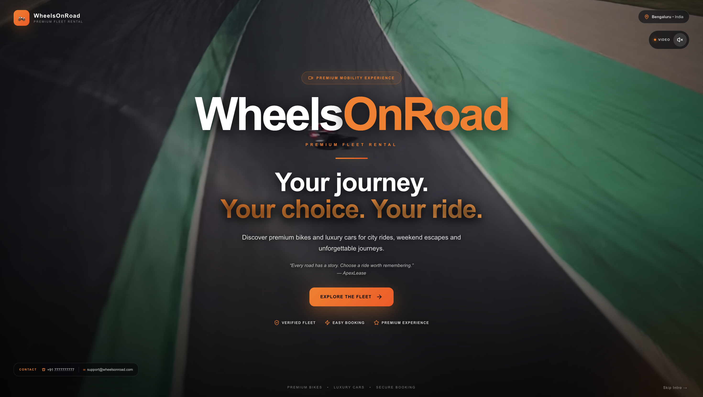

<div align="center">

# 🏍️ WheelsOnRoad 🚗

### Premium Superbike & Supercar Rental Platform

A full-stack **MERN vehicle rental platform** providing a modern booking experience with real-time fleet availability, dynamic pricing, secure authentication, UPI QR checkout, and a dedicated admin management console.

[](https://nodejs.org/)
[](https://react.dev/)
[](https://expressjs.com/)
[](https://www.mongodb.com/atlas)
[](https://socket.io/)
[]()

</div>

---

## 📌 Project Overview

**WheelsOnRoad** is a production-style full-stack MERN platform designed for renting premium superbikes and supercars.

The platform provides:

* 👤 Customer rental application
* ⚙️ Admin management console
* 🚘 Fleet management
* 📅 Vehicle availability checking
* 💰 Dynamic rental pricing
* 🔐 JWT authentication
* 🛡️ Role-Based Access Control
* ⚡ Socket.io real-time communication
* 💳 UPI QR-based checkout
* 🍃 MongoDB Atlas persistence

### 🎯 Real-World Problem

A major challenge in vehicle rental systems is preventing **double bookings when multiple customers attempt to reserve the same vehicle for overlapping dates**.

WheelsOnRoad addresses this using:

* Server-side availability validation
* Booking collision detection
* Atomic database checks
* Socket.io-based real-time booking locks

The backend validates availability before creating a booking, preventing conflicting reservations.

---

## 🔗 Repository

**GitHub:**
https://github.com/jeevank2865/WheelsOnRoad-Vehicle-Rental-MERN-Stack

---

## ✨ Key Highlights

| Feature             | Description                                           |
| ------------------- | ----------------------------------------------------- |
| 🚘 Fleet Management | Admin can add, edit, delete and manage vehicles       |
| 📅 Availability     | Checks vehicle availability for selected rental dates |
| ⚡ Real-Time Locking | Socket.io used for real-time booking coordination     |
| 💰 Dynamic Pricing  | Weekday/weekend pricing and multi-day discounts       |
| 🔐 Authentication   | JWT-based user authentication                         |
| 🛡️ RBAC            | Role-based customer and administrator access          |
| 💳 UPI Checkout     | QR-based UPI payment workflow                         |
| 📊 Admin Dashboard  | Fleet, booking, revenue and ride monitoring           |
| 🍃 MongoDB Atlas    | Persistent storage for application data               |
| 📁 File Uploads     | Vehicle and QR image upload support                   |

---

## 📑 Table of Contents

* [Project Overview](#-project-overview)
* [Key Highlights](#-key-highlights)
* [Features](#-features)
* [System Architecture](#-System-Architecture)
* [How It Works](#-how-it-works)
* [Tech Stack](#️-tech-stack)
* [Installation](#-installation)
* [Usage](#️-usage)
* [Project Structure](#-project-structure)
* [Application Showcase](#-application-showcase)
* [Security](#-security)
* [Results](#-results)
* [Future Enhancements](#-future-enhancements)
* [Contributing](#-contributing)
* [License](#-license)

---

# ✨ Features

## 👤 Customer Features

### 🏎️ Premium Fleet Browsing

* Browse premium superbikes and supercars
* Search vehicles
* Filter vehicles by category
* View vehicle information
* View rental prices

### 📅 Vehicle Booking

* Select rental dates
* Check vehicle availability
* Calculate rental duration
* View price breakdown
* Create bookings
* Track booking status

### ⚡ Real-Time Availability

* Server-side availability validation
* Booking collision detection
* Socket.io real-time communication
* Booking locks during the reservation process

### 💰 Dynamic Pricing

The system supports:

* Weekday pricing
* Weekend pricing adjustments
* Multi-day rental discounts
* Server-side price calculation

The final rental amount is calculated by the backend instead of trusting the price submitted by the client.

### 💳 UPI Checkout

* UPI QR-based payment
* Configurable UPI ID
* Payment instructions
* QR code display
* Rental amount summary

### 📊 User Dashboard

Customers can view:

* Active bookings
* Pending bookings
* Completed rentals
* Booking history

---

# ⚙️ Admin Features

## 📈 Admin Dashboard

Administrators can monitor:

* Fleet statistics
* Revenue
* Active rides
* Pending bookings
* Booking activity

## 🚘 Fleet Management

Administrators can:

* Add vehicles
* Edit vehicle information
* Delete vehicles
* Upload vehicle images
* Update rental prices
* Change vehicle categories
* Manage vehicle availability
* View fleet inventory

## 📋 Booking Management

Administrators can:

* View bookings
* Approve bookings
* Confirm bookings
* Activate rentals
* Cancel bookings

## 💳 Payment Settings

Administrators can configure:

* UPI ID
* Payment instructions
* QR code

These settings are stored in MongoDB instead of being hardcoded into the application.

---

# 🔄 How It Works

## 1. Booking Flow

```text
Customer
   │
   ▼
Browse Fleet
   │
   ▼
Select Vehicle
   │
   ▼
Select Rental Dates
   │
   ▼
Check Availability
   │
   ▼
Calculate Dynamic Price
   │
   ▼
Create Booking
   │
   ▼
UPI Checkout
   │
   ▼
Booking Confirmation
```

---

## 2. Booking Concurrency

When a customer attempts to book a vehicle, the backend:

```text
Customer Request
       │
       ▼
Backend API
       │
       ├── Check Existing Bookings
       │
       ├── Check Requested Date Range
       │
       ├── Check Vehicle Lock
       │
       ├── Calculate Final Price
       │
       └── Create Booking
                │
                ▼
           MongoDB Atlas
```

If another customer attempts to reserve the same vehicle for overlapping dates, the backend rejects the conflicting request.

---

## 3. Dynamic Pricing

```text
Base Rental Price
        │
        ▼
Weekday / Weekend Adjustment
        │
        ▼
Multi-Day Discount
        │
        ▼
Final Rental Price
```

The final price is calculated server-side before the booking is created.

---

## 4. Authentication & RBAC

```text
User Login
    │
    ▼
JWT Token
    │
    ▼
Authentication Middleware
    │
    ▼
Role Verification
    │
    ├───────────────┐
    ▼               ▼
Customer          Admin
Routes            Routes
    │               │
    ▼               ▼
Bookings       Fleet Management
Dashboard      Booking Management
               Payment Settings
```

Customers cannot access protected administrator operations.

---

# 🏗️ System Architecture

```text
                         🏍️ WHEELSONROAD
                               │
               ┌───────────────┴───────────────┐
               │                               │
               ▼                               ▼
        👤 CUSTOMER APP                  ⚙️ ADMIN APP
               │                               │
        Business Page                    Admin Dashboard
               │                               │
        Fleet Browsing                   Fleet Management
               │                               │
        Vehicle Details                  Booking Management
               │                               │
        Date Selection                   Payment Settings
               │                               │
        Price Calculation                Revenue / Rides
               │
        UPI Checkout
               │
               └───────────────┬───────────────┘
                               │
                               ▼
                        🚀 NODE + EXPRESS
                               │
               ┌───────────────┼───────────────┐
               │               │               │
               ▼               ▼               ▼
             JWT          Socket.io       Pricing Engine
           / RBAC        Real-Time        Server-Side
                         Communication      Pricing
               │               │               │
               └───────────────┼───────────────┘
                               │
                               ▼
                         🍃 MONGODB ATLAS
                               │
                ┌──────────────┼──────────────┐
                │              │              │
                ▼              ▼              ▼
              Users         Vehicles       Bookings
                                               │
                                               ▼
                                      Payment Settings
```

---

# 🛠️ Tech Stack

## Frontend

* React.js
* Context API
* Axios
* Lucide React
* Vanilla CSS
* Vite

## Backend

* Node.js
* Express.js
* Socket.io
* Multer

## Database

* MongoDB Atlas
* Mongoose ODM

## Authentication & Security

* JSON Web Tokens
* bcrypt
* Role-Based Access Control

## Development Tools

* Git
* GitHub
* VS Code
* MongoDB Compass

---

# 📦 Installation

## Prerequisites

Make sure you have installed:

* Node.js v16+
* npm
* Git
* MongoDB Atlas account

---

## 1. Clone the Repository

```bash
git clone https://github.com/jeevank2865/WheelsOnRoad-Vehicle-Rental-MERN-Stack.git

cd WheelsOnRoad-Vehicle-Rental-MERN-Stack
```

---

## 2. Backend Setup

```bash
cd backend

npm install
```

Create a `.env` file inside the `backend` directory:

```env
PORT=5000
MONGO_URI=your_mongodb_connection_string
JWT_SECRET=your_jwt_secret
```

Start the backend:

```bash
npm run dev
```

The backend will run on:

```text
http://localhost:5000
```

---

## 3. Frontend Setup

Open a new terminal:

```bash
cd frontend

npm install
```

Start the frontend:

```bash
npm start
```

The customer application will run on its configured frontend port.

---

## 4. Admin Dashboard Setup

Open another terminal:

```bash
cd admin

npm install

npm run dev
```

The admin dashboard will run on its configured Vite development port.

---

## 5. Optional Database Seeding

To populate the database with sample vehicles:

```bash
cd backend

node seedVehicles.js
```

---

# ▶️ Usage

## 👤 Customer Flow

```text
Landing Page
      │
      ▼
Fleet Page
      │
      ▼
Vehicle Details
      │
      ▼
Select Rental Dates
      │
      ▼
Dynamic Price Calculation
      │
      ▼
Booking
      │
      ▼
UPI Checkout
      │
      ▼
Booking Confirmation
```

## ⚙️ Admin Flow

```text
Admin Login
      │
      ▼
Admin Dashboard
      │
      ├── Fleet Management
      │
      ├── Booking Management
      │
      ├── Revenue Monitoring
      │
      ├── Active Rides
      │
      └── Payment Settings
```

---

# 📁 Project Structure

```text
WheelsOnRoad-Vehicle-Rental-MERN-Stack/
│
├── admin/
│   ├── public/
│   ├── src/
│   ├── .eslintrc.cjs
│   ├── vite.config.js
│   └── package.json
│
├── backend/
│   ├── src/
│   ├── uploads/
│   │   ├── vehicles/
│   │   └── qr/
│   ├── seedVehicles.js
│   ├── server.js
│   ├── package.json
│   └── .env
│
├── frontend/
│   ├── public/
│   ├── src/
│   ├── build/
│   └── package.json
│
├── Images/
│   ├── 1st.png
│   ├── User Fleet Page.png
│   ├── Vehicle Details Page.png
│   ├── UPI Checkout.png
│   ├── Fleet Management Console.png
│   └── MongoDB Database.png
│
├── .gitignore
└── README.md
```

> **Recommended:** Rename screenshot files to use hyphens instead of spaces, for example `User-Fleet-Page.png`. This makes Markdown paths cleaner and easier to maintain.

---

# 📸 Application Showcase

## 🏢 1. Business / Landing Page

The landing page introduces the WheelsOnRoad premium rental platform through a modern dark-themed interface.



---

## 👤 2. User Fleet Page

The user fleet page allows customers to explore the available collection of premium superbikes and supercars.

Users can:

* Browse vehicles
* Search vehicles
* Filter by category
* View rental prices
* Check availability
* Open vehicle details


---

## 🏍️ 3. Vehicle Details Page

The vehicle details page provides complete information about an individual rental vehicle.

It includes:

* Vehicle images
* Vehicle name
* Category
* Specifications
* Rental price
* Availability
* Rental date selection
* Dynamic price breakdown
* Booking action


---

## 💳 4. UPI Checkout

The checkout page provides a UPI QR-based payment experience.

Customers can view:

* Vehicle information
* Rental dates
* Number of rental days
* Base price
* Discounts
* Weekend adjustments
* Final rental amount
* UPI payment instructions
* QR code


---

## ⚙️ 5. Fleet Management Console

The Fleet Management Console provides administrators with centralized control over the rental inventory.

Administrators can:

* Add new vehicles
* Edit vehicle information
* Upload vehicle images
* Update rental prices
* Change vehicle categories
* Manage availability
* Remove vehicles
* View fleet inventory


---

## 🍃 6. MongoDB Database

MongoDB Atlas acts as the primary database for the application.

The database stores information including:

* Users
* Vehicles
* Bookings
* Authentication data
* Payment configuration
* Administrative settings


---

# 🏆 Results

## Customer

* ✅ Premium rental landing page
* ✅ Fleet browsing
* ✅ Vehicle search and filtering
* ✅ Vehicle details
* ✅ Real-time availability
* ✅ Dynamic pricing
* ✅ Booking workflow
* ✅ UPI QR checkout
* ✅ Customer dashboard

## Admin

* ✅ Admin authentication
* ✅ Fleet management
* ✅ Vehicle CRUD operations
* ✅ Vehicle image uploads
* ✅ Booking management
* ✅ Booking approval
* ✅ Active ride monitoring
* ✅ Revenue monitoring
* ✅ Payment configuration

## Backend

* ✅ REST API architecture
* ✅ MongoDB Atlas integration
* ✅ JWT authentication
* ✅ RBAC authorization
* ✅ Password hashing
* ✅ Server-side pricing
* ✅ Booking collision detection
* ✅ Socket.io communication
* ✅ File upload handling

---

# 🔐 Security

The application follows several security practices:

* `MONGO_URI` is stored in environment variables.
* `JWT_SECRET` is stored in environment variables.
* `.env` files are excluded using `.gitignore`.
* Passwords are hashed using bcrypt.
* Admin routes are protected using JWT authentication.
* Role-based authorization protects administrative operations.
* Rental prices are calculated server-side.
* Booking availability is validated by the backend.

### `.gitignore`

```gitignore
node_modules/
.env
.env.local
dist/
build/
.DS_Store
npm-debug.log*
```

> **Never commit MongoDB credentials, JWT secrets, API keys, or other sensitive credentials to GitHub.**

---

# 🔮 Future Enhancements

Potential future improvements include:

* 💳 Razorpay / Stripe payment integration
* 📧 Automated email confirmations
* 📱 SMS booking notifications
* 📍 GPS-based vehicle tracking
* 📅 Advanced availability calendar
* 🤖 AI-powered vehicle recommendations
* 📊 Advanced analytics dashboard
* ☁️ Cloud image storage
* 🔔 Real-time booking notifications

---

# 🤝 Contributing

Contributions are welcome.

### 1. Fork the repository

### 2. Create a feature branch

```bash
git checkout -b feature/your-feature
```

### 3. Make your changes

### 4. Commit your changes

```bash
git add .

git commit -m "Add your feature"
```

### 5. Push your branch

```bash
git push origin feature/your-feature
```

### 6. Create a Pull Request

Submit a Pull Request for review.

---

# 📄 License

This project is **proprietary** and built specifically for the WheelsOnRoad premium mobility platform.

**All rights reserved.**

---

<div align="center">

### 🏍️ WheelsOnRoad

**Built with ⚙️ MERN and a focus on real-world rental management challenges.**

</div>
